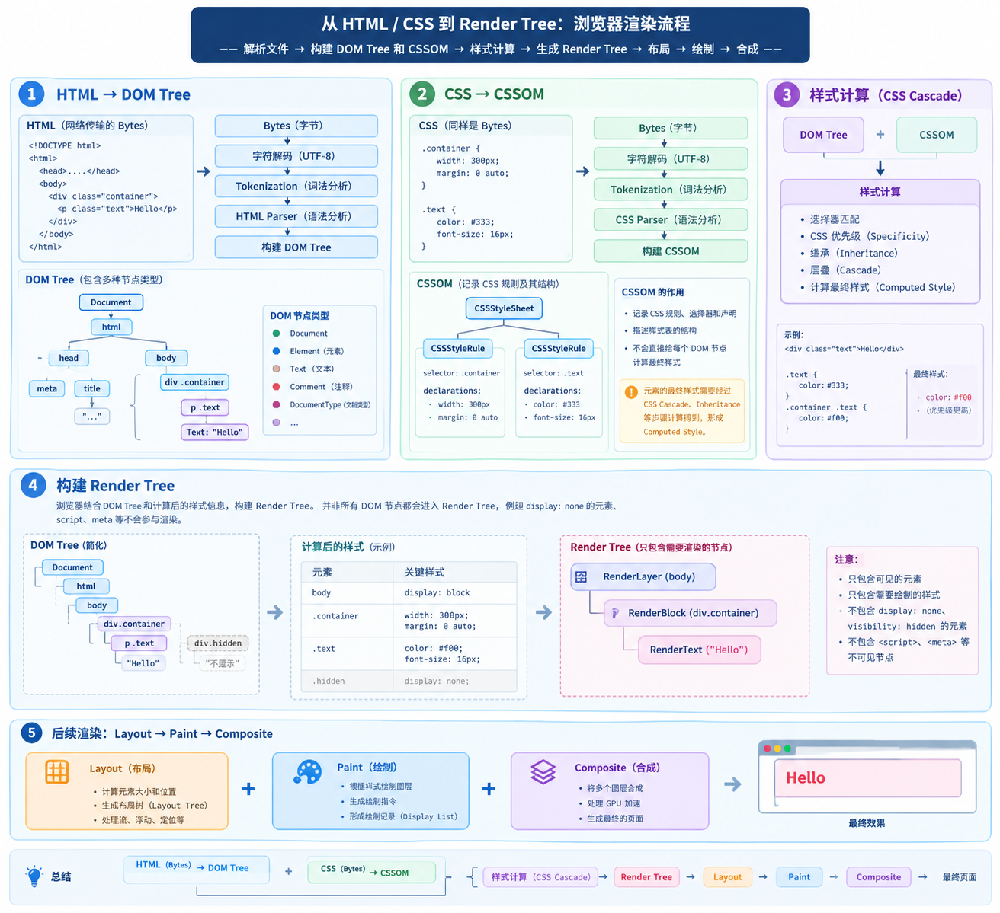

# CSS 深度讲解篇章
> 查看兼容性: https://caniuse.com/
> 重绘与回流 操作: https://csstriggers.com/
> 选择器, 盒模型, 文档流, 布局, 样式计算, 浏览器渲染, CSS 函数, CSSVariable, 动画 等相关课程

在 前端中 JS 操作 DOM 效率尤为底下, 所以能够使用 CSS 实现的功能优先推荐 CSS 实现

CSS 是声明式样式语言如何做到交互呢? **浏览器在样式计算阶段会维护一组 伪类状态, 这个状态通过用户交互事件(如 :hover,:active) 等会改变这些状态并重新计算样式 配合选择器则可以将状态传递到另一个元素上**

CSS 在状态动画变化时候 可以由后面的阶段来处理 也可能由 GPU 线程处理 更流畅提升效率

浏览器其实对 CSS 检查放的非常宽松若遇到不认识或不合法则丢弃继续解析后面的, 静默处理很好但是也让 BUG 不好排查

## CSS 深入方法论
1. 按类型将 CSS 属性分类记忆 (布局尺寸界面文字交互) 再按照 选择器分类(选类或ID,层次,集合,条件,行为,状态,结构,属性,伪元素 等)
2. 效果粒度化

## 浏览器将代码转换为像素
> 不同浏览器为何渲染效果不同? 浏览器从拿到HTML/CSS到绘制出页面过程是什么? 如何处理兼容性
CSS 的基层是 浏览器, CSS 只是给浏览器看的 绘制说明, 在不同浏览器理解的CSS是不同的 因为渲染引擎不同, 我们来看看最早图形浏览器就是 NCSA 发布的 Mosaic 在 1993 年, 1994 年网景就发布了 Navigator, 1995 微软发布 IE 至此 浏览器大战开始, 1996~1998 年Opera发布 网景开源并推出Mozilla, 2001 年 IE6 发布, 2002~2003 年 Firefox 和 Safari 相继发布, 2008 年 Google 发布 Chrome 最后 Blink 内核为事实标准

世界五大浏览器: Chrome, Safari, Firefox, Opera, IE/Edge 通过 [市场份额](https://gs.statcounter.com/)

不同内核所对应的浏览器, 大多数非自研浏览器内核都是基于都是 Chromium 二开, 双内核就是 Blink 极速模式 + Trident 兼容模式
|   内核   | 研发 | 浏览器 |
|   ---   | --- | --- |
|   Blink   | 谷歌 + 欧朋 自研 | Chrome28+, Opera 15+, Edge(2020起), 绝大多数国产浏览器 |
|   Webkit   | 苹果自研 | Chrome1~28,Safari 1+,IOS 上所有浏览器 |
|   Gecko   | 网景/Mozilla | Navigator,Firefox 1+ |
|   Presto   | 欧朋 | Opera7~14 |
|   Trident   | 微软 | IE4+,旧Edge |

1. 渲染引擎
由于渲染引擎(浏览器内核)不同所以内核对 规范实现层度/细节与默认样式 是不同的 所以我们在不同浏览器下渲染效果是不同的 在最常用的内核如下: Blink, Webkit, Gecko, Presto, Trident

2. 渲染过程: 因为要对你写出的 CSS 为何会卡, 为何改一个属性页面会发生如此大的变化 这就是 **关键渲染路径(从浏览器接收到 HTML/CSS/JS 再到 解析 构建 渲染 布局 绘制 合并 最后到呈现的一系列过程)**
- 解析文件并构建渲染树: 浏览器先解析 HTML/CSS 在构建 DOMTree 和 CSSOM, 随后结合 DOM和CSSOM以及样式计算结构构建出RenderTree 在 经过Layout, Paint, Composite 完成最终渲染
  - HTML -> DOM Tree: 网络传输数据以Bytes形式到达浏览器,浏览器通过文档编码解析为字符流,通过Tokenization 将字符解析为 Token, 在通过 HTML Parser根据标签关系构建出DOMTree
  - CSS -> CSSOM Tree: 浏览器解析 CSS 将CSS规则转换为 CSSOM(CSSObjectModel), CSSOM 主要描述 CSS 样式表,选择器,声明规则而非记录节点最终样式
  - 
- 图层渲染: 根据渲染树布局(回流), 根据布局绘制(重绘)
- 合并图层: 图层逐张合并后展示到浏览器中

3. **为何 script 会阻塞渲染**
因为 HTML 解析与 JS 执行之间存在与同步的 DOM 数据依赖 同步的 JS 可以读取,修改或通过 document.write 直接改写 正解析的文档 所以 脚本无法安全的让 HTMLParser 期间继续构建 DOM 所以遇到 script 旧必须暂停解析 HTML 执行完 JS 后在恢复解析

JS 可以操作 DOmTree 和 CSSOM(getComputedStyle) 所以浏览器执行 JS 前需要保证 CSSOM 是最新的 这就是 CSS 也会间接阻塞 JS 从而影响 DOM 构建

4. script 的 defer 和 async 树形
- defer: 下载与解析并行, 执行推迟到 DOM 构建完成, 在 DOMContentLoaded 之前, 多个 defer 按序执行
- async: 并行下载, 下载完后立即执行(会打断解析顺序不保证), 适合不依赖 DOM 独立脚本(如 统计代码)
- 相同点: 能推迟的都推迟 让解析器先完成 DOM 和 CSSOM