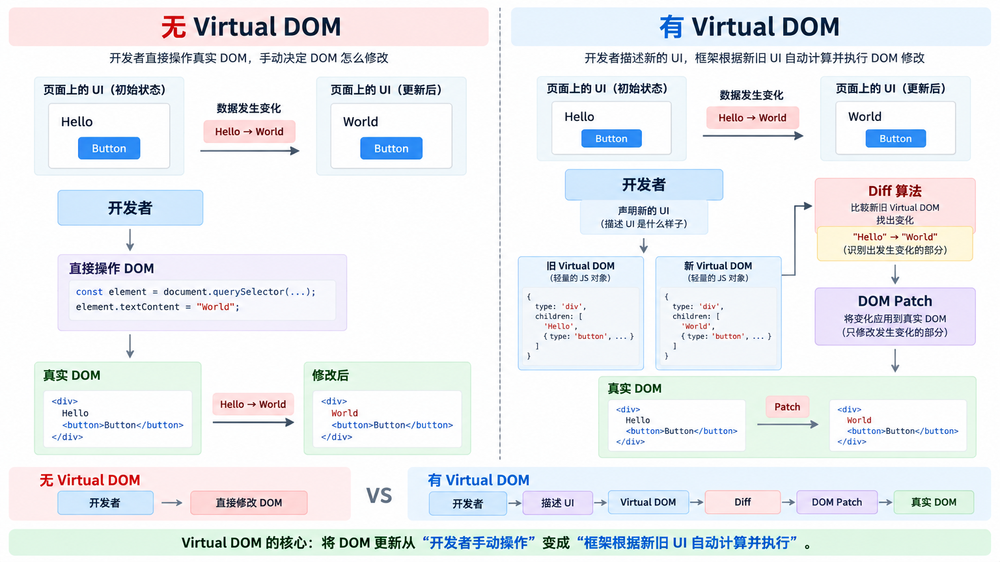

# DIFF
> Vue2/Vue3

## Vue 为何需要使用 虚拟 DOM
> 主要原因: 主要作用为性能优化, 提供跨平台以及简化开发流程, 既中间层
1. 性能优化: 减少直接操作实际DOM次数
2. 跨平台: 虚拟DOM作为抽象层,将实际DOM为一个跨平台表示 使得 Vue 可以运行不同平台(小程序/单元测试 等, 不同平台都用这个对象表示 DOM)
3. Diff 算法: 比较新老DOM树差异(通过 DIFF 算法找到差异), 找出需要更新部分进行更新

## Vue Key 的作用
1. 主要作用: 标识节点, 在节点更新时做的优化, key 在同一层级兄弟必须是唯一的, 因为在节点复用时判断节点是否相同 就是看 **标签和key** 是否相同 若相同则复用

## Vue2 Diff 原理
1. 思想: 递归 + 双指针(双端比对)
Vue2 通过 递归 + 双指针在引入 优化策略来实现
同层级节点比较(key 和 标签名称)
比较子节点(采用双指针方式比较, 递归比较子节点)
2. Diff
  - patch
  - patchVnode 比较两个节点差异做更新 文本, 孩子, 属性
    - isSameVnode 两个节点是否为同一节点, 若不相同删除替换即可

## Vue3 Diff 原理