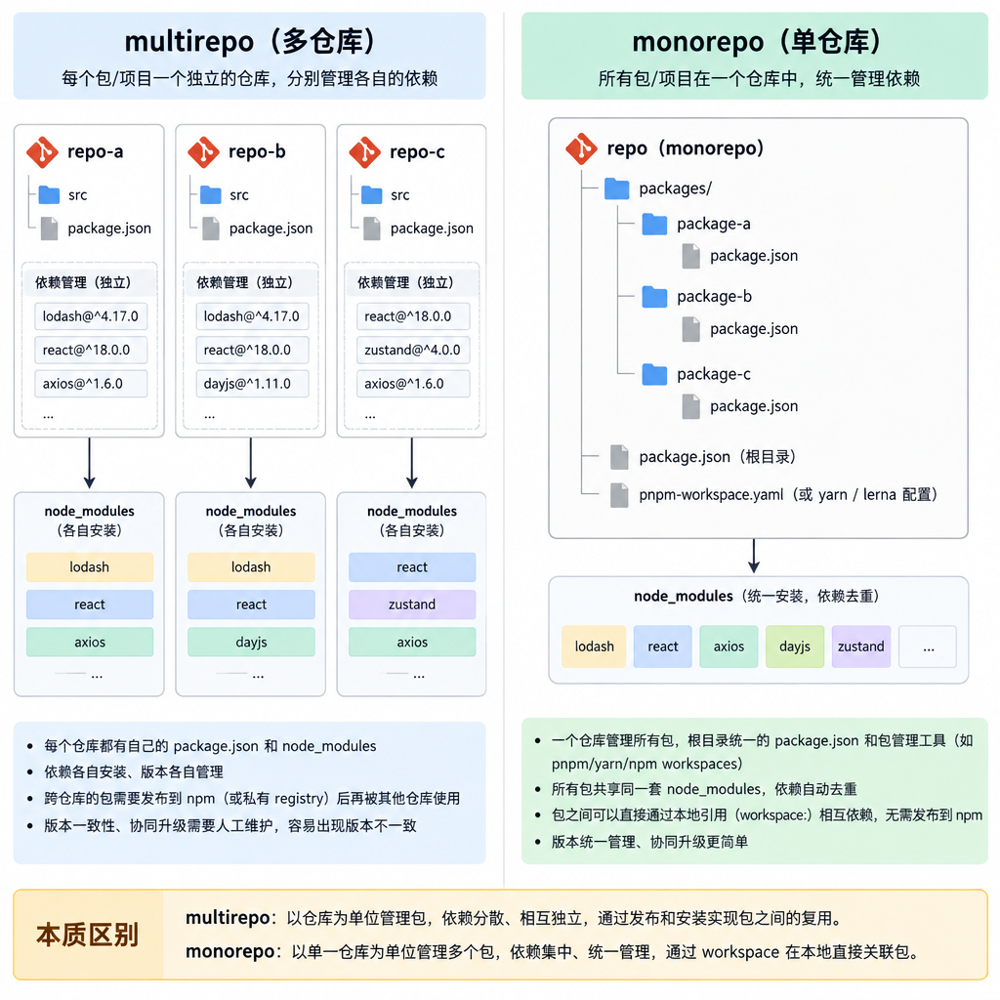
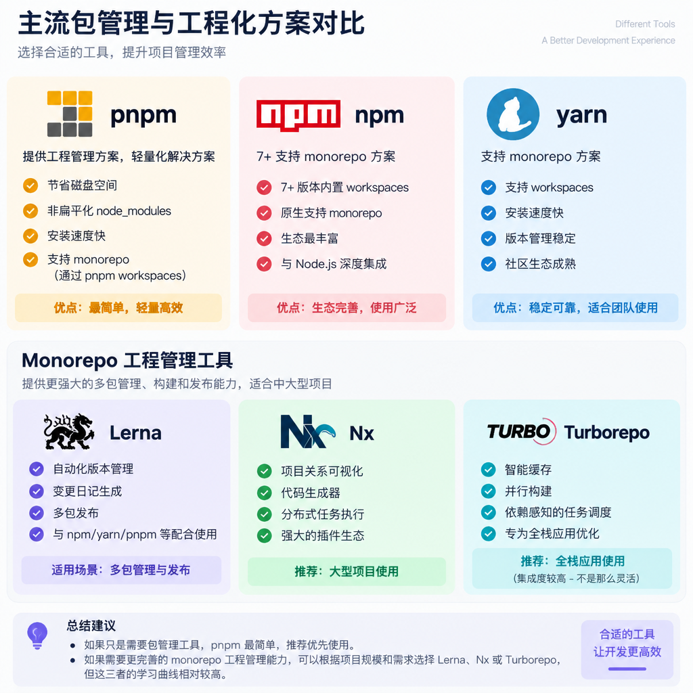
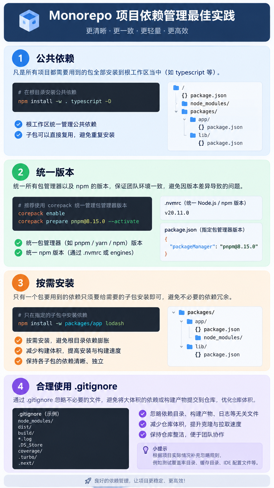

# Multi-repo 与 Monorepo

## Multi-repo 和 Monorepo 使用场景
在一个业务中可能不只是一个项目, 如下
- 业务: 前端/后端/移动端
- 基建: 组件库/函数库/类型库/脚手架

**痛点: 开发链路较为繁琐 如 修改公共代码 发布 Package 在 对应 Project 更新依赖 在验证兼容性 最后继续修复** 这就是多仓开发的痛点

**单仓管理优势: 轻松跨项目引用(无需发布), 统一工具链, 公共依赖 既 跨项目修改可以在同一个变更上下文中完成**

**单仓库劣势: 仓库体积增加, 权限管理复杂, CI/CD 测试时间需要更长**

**我们这里有两种项目管理模式 一个就是 单仓库管理(Monorepo) 和 多仓管理(Multi-repo) 这就是 它们之间的区别**
- 单仓管理: 一个 Repository, 管理多个 Project/Package
- 多仓管理: 多个 Repository, Project/Package分散在不同仓库


## 管理工具
- PackageManager/Workspace
  - pnpm(提供工程管理方案, 轻量化解决方案)(节省磁盘空间, 非扁平化 node_modules)
  - npm(7+ 支持 monorepo 方案)
  - yarn(支持 monorepo 方案)
- 任务编排
  - Nx(项目关系可视化,代码生成器,分布式任务执行 推荐大型项目使用)
  - Turborepo(智能缓存,并行构建,依赖感知的任务调度 推荐 全栈应用使用)
- 任务管理
  - lerna(自动化版本管理, 变更日记生成, 多包发布)
若主要需求为 Workspace, 依赖管理跨包引用 那么推荐使用 Pnpm. 如需要进一步则可以使用 任务编排与缓存 你就可以考虑 Turborepo, 需要版本管理与多包发布则可以选择 Lerna



## Monorepo 管理原则
1. 公共依赖: 凡是所有项目都需要用到的工程基础设施 安装到 根工作区当中(如 typescript/统一工具链 等)
2. 统一版本: 统一`Node/Package Manager` 的版本
3. 按需安装: 只有一个包要用到的依赖只给需要的子包安装即可
4. 合理使用 .gitignore: 优化其包体积



## 仓库搭建
这里我们从 0 到 实现 单仓管理 + 代码检查与提交检查所有功能
其中需要的配置在如下文档查找
> https://prettier.io/docs/
> https://eslint.org/docs/latest/

推荐目录结构
```
root-workspace
├── .github/
├── .husky/
├── .vscode/
├── apps/
│   ├── web/
│   └── server/
├── packages/
│   ├── components/
│   └── types/
├── scripts/
├── .gitignore
├── .npmrc
├── commitlint.config.js
├── eslint.config.js
├── package.json
├── pnpm-workspace.yaml
├── prettier.config.ts
├── README.md
└── ...
```


1. 建立工作目录
```shell
mkdir imageStack

cd imageStack

mkdir apps/
mkdir apps/web
mkdir apps/server

mkdir packages/
mkdir packages/components
mkdir packages/types
```
2. 配置多包选项
```shell
touch pnpm-workspace.yaml
```
```yaml
# 子包的位置
packages:
  - 'apps/*'
  - 'packages/*'
```
3. 初始化工程
```shell
# 工程根目录下初始化
pnpm [--workspace-root|-w] init
```
修改 根目录下的 package.json 名称
```json
{
  name: "imagestack"
}
```
4. 创建子包
```shell
cd apps/web
pnpm init

cd apps/server
pnpm init

cd packages/components
pnpm init

cd packages/types
pnpm init
```
将 package.json 的名称统一改为, 这里的 package-name 是子包的名称
```json
{
  "name": "@imagestack/ <pacakge-name>"
}
```
5. 版本锁定
在 根 package.json 下完成
```json
{
  "engines": {
    "node": ">=24.16.0",
    "pnpm": ">=11.20.0"
  },
  "packageManager": "pnpm@11.20.0"
}
```
```shell
touch .npmrc
```
```text
# 严格模式
engine-strict=true
```

```shell
pnpm add -D -w <package>
```

6. Root 级工程基础设施
Root `tsconfig.json` 作为公共的 TS 配置 (子包可以继承 Root `tsconfig.json` 的配置, 若某子包有特殊要求则可以在自己包 `tsconfig.json` 中覆盖对应配置)
```shell
pnpm add -D -w typescript @types/node
tsc --init
```

7. 代码风格与质量检查
```shell
pnpm -Dw add prettier
pnpm -Dw add eslint globals @eslint/js typescript-eslint eslint-plugin-prettier eslint-config-prettier eslint-plugin-vue


touch eslint.config.js
touch prettier.config.ts
touch .prettierignore
```

添加命令脚本
```json
{
  // ...
  "scripts": {
    // ...
    "lint:prettier": "prettier --write \"**/*.{js,ts,mjs,json,tsx,css,less,scss,vue,html,md}\"",
    "lint:eslint": "eslint"
    // ...
  }
  // ...
}
```
8. 添加忽略文件
```shell
touch .gitignore
```
```gitignore
node_modules/
dist/
build/
coverage/
.cache/
.turbo/
.nx/
.env
.env.*
!.env.example
```
9. 提交检查配置
```shell
pnpm add -D -w husky lint-staged @commitlint/cli @commitlint/config-conventional

pnpm exec husky init

touch commitlint.config.js
# touch .lintstagedrc.js 你也可以放在 package.json
```
package.json 命令配置
```json
{
  "scripts": {
    "precommit": "lint-staged"
  },
  "lint-staged": {
    "*.{ts,vue,js,json}": [
      "prettier --write"
    ],
    "*.{md,mdx}": [
      "prettier --write"
    ]
  }
}
```
将这两句命令分别放在 `.husky/pre-commit` `.husky/commit-msg` 中
```shell
# 在 pre-commit 配置, 提交前检查
pnpm exec lint-staged

# 在 commit-msg 提交消息检查
pnpm exec commitlint --edit "$1"
```
8. 跨包引用
```shell
# 将 components 和 types 安装到 @imagestack/web 中
pnpm add @imagestack/components@workspace:* --filter @imagestack/web
pnpm add @imagestack/types@workspace:* --filter @imagestack/web

# 安装外部包到执行子包
pnpm add axios --filter @imagestack/web
```