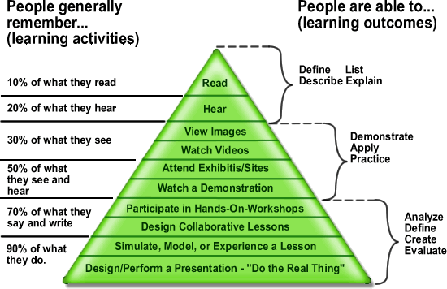

# 代码质量评判方法论
> 编写高质量代码的技巧, 方法论

## 学习金字塔 & 费曼学习法
[学习金字塔](https://en.wikipedia.org/wiki/Learning_pyramid) 你可以理解为是一个 人类在不同学习方式中 人对知识的理解记忆和应用程度的学习模型, 记忆知识你知道它是什么, 理解你就可以解释它为什么, 应用 你就可以通过实际场景去使用它, 分析你可以拆解问题, 创造你就可以解决新问题
学习的过程并不是一个过程性 而是 循环往复的, 这里的处理 过程是非常复杂的
```
输入 -> 处理/内化 -> 输出
处理: 理解 -> 提取(从大脑中反复提取) -> 应用 -> 反馈 -> 重构认知
```

你可以发现我们每一次学习就是在修复认知上的偏差, 我们每一次修复就离正确解更进一步

## 如何写出高质量代码
很多人对代码的评判通过 "好与坏" 来进行评判 这种形式非常笼统 没有一个较为准确的标准 不同的人对代码的判断标准是不同的 "这段代码有多好?又有多坏呢?" 通过这句话可以看到 无法基于 "好坏" 来进行评判

但是评判标准有哪些呢? 这里是有非常多的我这里罗列一些常用的, 这里那么多评判标准其实都是相互包含关系的, 比如 可扩展性与可维护性 这两个就是相互包含关系 你需要好扩展的代码才好添加功能, 所以我们需要通过综合各种标准来进行评判, 这里每个人按照标准来评判也会有不同的结构 因为我们是通过 主观来判断的 无法客观进行判断. 就算是 AI 也无法给出 绝对客观的代码质量

下面是给出我的理解, 我们总是要用 最低代价去修改加入代码 去节省时间, 所以前期需要花费大量时间去将 "变" 识别出来将 "不变" 固定下来. 这对后期的 CodeReview 会有大量好处. 在我主观判断中 设计模式核心就是 这两个字
```
可扩展性(extensibility): 未来需要添加功能支持新场景和实现是否能尽量 少修改原有代码从而插入新代码
可维护性(maintainability): 未来发生变化时我们是否可以用最小成本较低风险对其完成修改并且控制修改带来的影响和BUG风险
灵活性(flexibility): 需求或环境变化亦或者使用方式发生变化 代码是否容易适应变化
可复用性(reusability): 一个模块/函数/组件 是否可以在不同场景下重复使用而无需复制大量代码或修改
可读性(readability): 开发者是否能快速准确理解代码意图结构和执行逻辑
可测试性(testability): 代码是否能够被单独验证而无需依赖大量外部环境(测试越简单表明可测试性越好)
高内聚低耦合(high cohesion loose coupling): 一个模块都应该围绕一个明确的职责, 减少模块之间不必要的依赖
文档详尽(well-documented): 代码重要设计意图使用方式约束和边界条件与业务规则能够被有效记录
模块化(modularity): 将复杂系统拆分为明确职责的边界清晰可独立理解开发测试和修改的模块
```

**我们要写出优秀的代码 还需要掌握一些方法论/面向对象设计思想/设计原则/设计模式/编码规范/重构技巧 等 这些都是辅助与编写出 "高质量代码" 的基础 毕竟 基层建筑决定上层建筑**


## 总结
我们如何评判代码质量呢: 通过 可读性/可扩展性/灵活性/模块化/高内聚低耦合/可复用性/文档详尽/可测试性 等综合因素对代码质量进行判断
