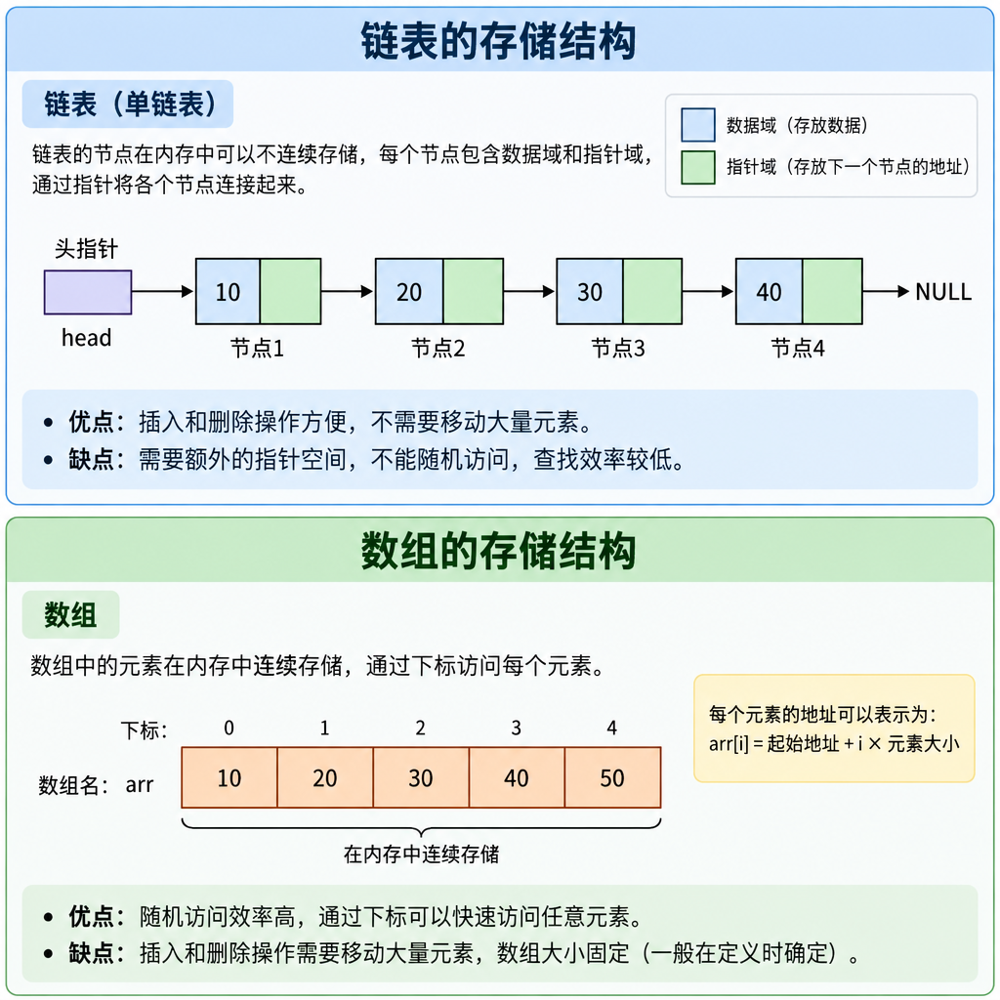

# 链表(Linked List)

## 链表解决的问题
链表的出现就是为了解决 "数组随着数据规模而动态变化" 和 "插入/删除 移动频繁的问题".

上一章节我们的数组 通过 内存申请 多大空间就存储多少数据呢? 如果要存储需要过量那么我们解决 方案就是 扩容操作, 但是扩容操作并不是在原来基础上进行扩容 而是内存中重新开辟一个 更大的空间 这时原来的数据 就需要 逐一拷贝过去, 这是不是一个耗时操作. 假设数据规模在 10W+ 那么拷贝消耗的 时间耗时是非常慢的.

数组还有一个问题就是 插入/删除 移动频繁问题 我们在M位置插入那么我们需要将 `[M, N)` 范围的元素整体往后移动一位, 时间复杂度通常在 `O(n)`

链表天然就支持解决 虽则数据规模变化而变化的数据结构 以及 时间复杂度为`O(1)` 的插入/删除操作. 但是链表查找的 时间复杂度为`O(n)` 且不支持 随机存取 操作

下面就是 链表 与 数组的 内存存储图

我们可以发现 链表是通过 指针/引用 将节点逐一连接起来 那么也可以说明 每个节点 内存地址是不连续的也可以通过 指针/引用 找到下一个节点的存在, 链表就是通过 节点之间引用来表达数据之间的联系

## 链表应用场景

在日常开发中 链表 的应用场景在哪里呢? 这里我从 系统层面 到 应用层面进行举例

- `LRU Cache 哈希表与双向链表实现 O(1) 查找/删除/移动`
- `浏览器历史记录 使用双向链表表达 前进后退关系`
- `播放列表(上一首/下一首/删除当前歌曲/插入歌曲)`
- `操作系统的进程和任务管理 内核有大量用动态对象的链式结构`
- `内存管理 通过链式结构维护空闲块`
- `HashMap 冲突处理 通过 链地址法来解决哈希冲突`
- `Undo/Redo 操作(常见于 编辑器)`
- `Vue/React 内部实现`
- `消息队列/任务队列`

从操作系统到内存管理等底层再到开发中会用到的 HashMap, LRUCache 等基础设施都可以看到链表的影子

## 链表分类
### 单链表

### 双向链表

### 循环链表

### 双向循环链表

## LeetCode
[两数相加](https://leetcode.cn/problems/add-two-numbers)

[删除链表的倒数第 N 个节点](https://leetcode.cn/problems/add-two-numbers)

[合并两个有序链表](https://leetcode.cn/problems/add-two-numbers)

[旋转链表](https://leetcode.cn/problems/add-two-numbers)

[环形链表](https://leetcode.cn/problems/add-two-numbers)

[反转链表](https://leetcode.cn/problems/add-two-numbers)

[设计链表](https://leetcode.cn/problems/add-two-numbers)
